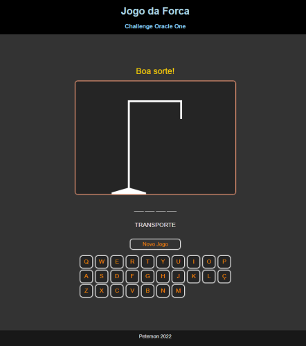

# Jogo da Forca – Alura Challenge Oracle (ONE)

Projeto desenvolvido como parte do programa **ONE - Oracle Next Education | Alura**.  
Esse jogo faz parte dos meus estudos de JavaScript e HTML5 Canvas!

---

## Sobre o Projeto

- **Objetivo:** Jogo da Forca desenvolvido do zero, utilizando HTML, CSS e JavaScript puro, com manipulação de Canvas.
- **Quando:** [Fevereiro/2022]
- **Desafio:** Atividade prática do programa Alura/Oracle.
- **Aprendizados:** Manipulação de Canvas, lógica de jogo, interação com DOM, estruturação de projetos web.

---

## Como Rodar

- **Local:** Baixe o repositório, abra `index.html` no navegador.
- **Online:** [Jogar agora](https://petersonros.github.io/Alura_Challenge_Oracle_Hangman/)

---

## Funcionalidades

- Teclado virtual para interação.
- Dica da categoria da palavra.
- Feedback de vitória/derrota.
- Desenho progressivo do boneco da forca via Canvas.

---

## Limitações & Observações

- Código feito com conhecimento da época (2022) – sem frameworks modernos.
- Algumas melhorias poderiam ser feitas, mas o objetivo é manter o projeto como registro do meu aprendizado.
- Uma futura versão Next.js está planejada!

---

## Cursos Relacionados & Certificados

Projeto desenvolvido durante os seguintes cursos do programa ONE - Oracle Next Education | Alura:

- [Iniciante em Programação - ONE](https://cursos.alura.com.br/user/petersonrobertodossantos/degree-programacao-one-268958/certificate)

[Veja todos os meus certificados na Alura](https://cursos.alura.com.br/emprega-one/profile/petersonrobertodossantos)

---

## Prints

---

## Evolução

- [ ] Planejamento de nova versão utilizando Next.js, React e melhores práticas modernas de front-end.

---

## Créditos

- Inspirado e desenvolvido como atividade do programa **ONE - Oracle Next Education | Alura**

---

> ⚠️ Este projeto reflete meu nível de conhecimento em 2022. Não utilize como referência de boas práticas atuais.  
> Para ver minha evolução, acompanhe novos projetos no meu GitHub!

